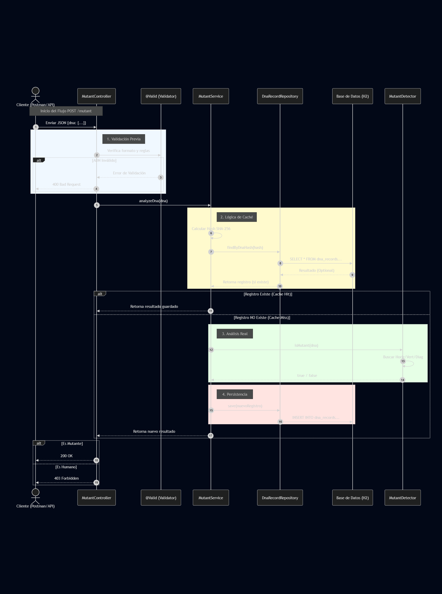

# 🧬 Mutant Detector API

API REST para detectar mutantes basándose en su secuencia de ADN. Proyecto desarrollado para el examen técnico de MercadoLibre.

## 🚀 Tecnologías

- Java 17
- Spring Boot 3
- H2 Database (Base de datos en memoria)
- JUnit 5 & Mockito (Testing)
- Lombok
- Swagger / OpenAPI

## 🛠️ Instrucciones de Ejecución

### Prerrequisitos
Tener instalado Java 17 o superior.

### Ejecutar localmente
1. Clonar el repositorio.
2. Navegar a la carpeta raíz.
3. Ejecutar el comando:

```bash
# En Windows:
./gradlew.bat bootRun

# En Linux/Mac:
./gradlew bootRun

## 📊 Diagrama de Secuencia (Arquitectura)

Este diagrama representa el flujo de la operación principal de detección:



